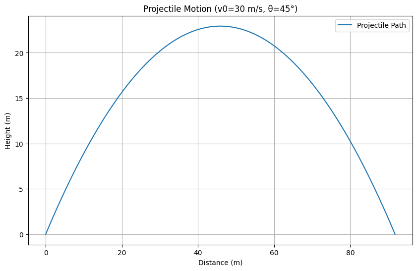
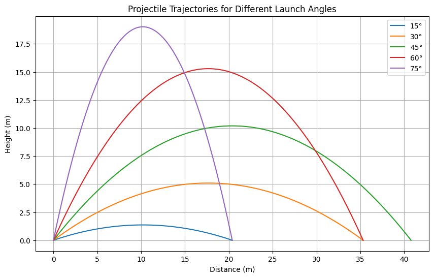

# Problem 1
Here’s the correctly formatted version, ensuring that formulas display properly when copied and pasted.  

---

### **Projectile Motion: Definition & Equations**  

**Projectile motion** refers to the motion of an object launched into the air under the influence of gravity, following a **parabolic path**. It is analyzed as two independent motions:  

1. **Horizontal motion** – constant velocity (no horizontal acceleration if air resistance is ignored).  
2. **Vertical motion** – uniformly accelerated motion due to gravity.  

---

### **Equations of Projectile Motion**  

Let:  
- \( v_0 \) = Initial velocity  
- \( \theta \) = Launch angle  
- \( g \) = Acceleration due to gravity (9.81 m/s²)  
- \( t \) = Time  

#### **1. Horizontal Motion**  
- **Velocity:**  
  $$ v_x = v_0 \cos\theta $$  
  (Constant, since no horizontal acceleration)  
- **Displacement:**  
  $$ x = v_0 \cos\theta \cdot t $$  

#### **2. Vertical Motion**  
- **Velocity:**  
  $$ v_y = v_0 \sin\theta - g t $$  
- **Displacement:**  
  $$ y = v_0 \sin\theta \cdot t - \frac{1}{2} g t^2 $$  
- **Time to reach max height:**  
  $$ t_{\text{max}} = \frac{v_0 \sin\theta}{g} $$  
- **Maximum height:**  
  $$ h_{\text{max}} = \frac{(v_0 \sin\theta)^2}{2g} $$  

#### **3. Time of Flight**  
The total time the projectile is in the air:  
  $$ T = \frac{2 v_0 \sin\theta}{g} $$  

#### **4. Range (Horizontal Distance)**  
The total horizontal distance traveled:  
  $$ R = \frac{v_0^2 \sin(2\theta)}{g} $$  

---

### **Key Points**  
- The trajectory is a **parabola**.  
- The horizontal and vertical motions are **independent** of each other.  
- The optimal launch angle for maximum range is **45°** (without air resistance).  

import numpy as np
import matplotlib.pyplot as plt

# Constants
g = 9.81  # Gravity (m/s^2)
v0 = 20   # Initial velocity (m/s)

# Function to calculate trajectory
def projectile_trajectory(v0, angle):
    angle_rad = np.radians(angle)
    t_flight = 2 * v0 * np.sin(angle_rad) / g
    t = np.linspace(0, t_flight, num=500)
    
    x = v0 * np.cos(angle_rad) * t
    y = v0 * np.sin(angle_rad) * t - 0.5 * g * t**2
    
    return x, y

# Launch angles to plot
angles = [15, 30, 45, 60, 75]

# Create the plot
plt.figure(figsize=(10, 6))

for angle in angles:
    x, y = projectile_trajectory(v0, angle)
    plt.plot(x, y, label=f'{angle}°')

plt.title('Projectile Trajectories for Different Launch Angles')
plt.xlabel('Distance (m)')
plt.ylabel('Height (m)')
plt.legend()
plt.grid(True)
plt.show()
