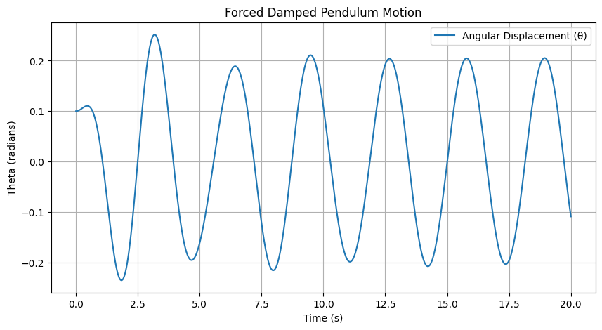
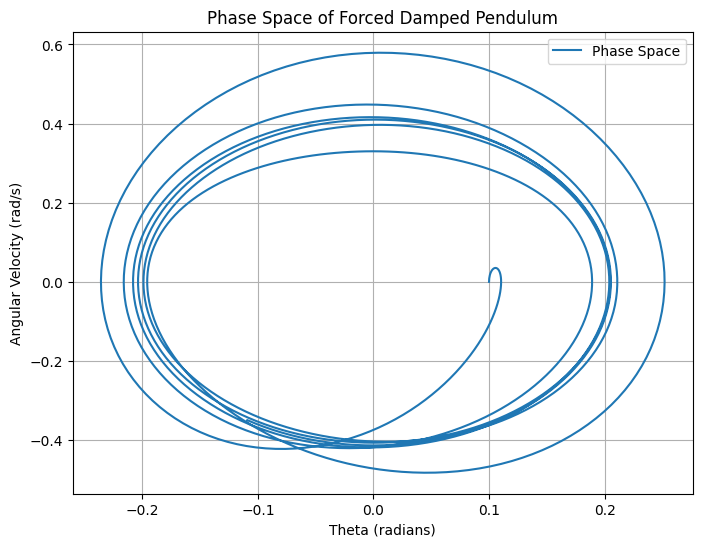
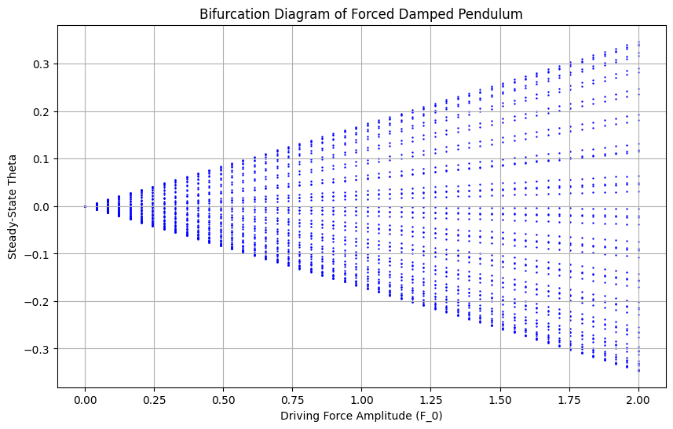

# Investigating the Dynamics of a Forced Damped Pendulum
# Investigating the Dynamics of a Forced Damped Pendulum

## **Motivation**
The forced damped pendulum is a classic example of a nonlinear dynamical system that exhibits a wide range of behaviors, from simple periodic motion to deterministic chaos. By studying its dynamics, we gain insights into complex oscillatory systems in physics, engineering, and even biological rhythms.

This investigation explores:
- The governing equations of motion.
- The effects of damping and external forcing.
- Phase space analysis and bifurcation.
- Computational simulations for visualization.

---

## **Theoretical Background**
### **Newton’s Second Law and Equations of Motion**
The motion of a simple pendulum of length \( L \) and mass \( m \) under the influence of gravity, damping, and an external periodic force is governed by Newton’s Second Law:
\[
 m L \frac{d^2\theta}{dt^2} = - mg \sin\theta - b \frac{d\theta}{dt} + F_0 \cos(\omega t),
\]
where:
- \( \theta \) is the angular displacement,
- \( g \) is the acceleration due to gravity,
- \( b \) is the damping coefficient,
- \( F_0 \) is the amplitude of the external force,
- \( \omega \) is the driving frequency.

Rearranging, we get the nonlinear second-order differential equation:
\[
 \frac{d^2\theta}{dt^2} + \gamma \frac{d\theta}{dt} + \frac{g}{L} \sin\theta = \frac{F_0}{mL} \cos(\omega t),
\]
where \( \gamma = \frac{b}{m} \) is the damping factor.

---

## **Numerical Simulations**
### **Python Code for Solving the Equation**
We numerically solve the equation using the **Runge-Kutta method** for better accuracy:

---

## **Graphical Representations**
### **1. Time Evolution of Angular Displacement**
A plot of \( \theta(t) \) over time shows how the pendulum oscillates under damping and periodic forcing.

### **2. Phase Space (θ vs. Angular Velocity)**
The trajectory in phase space helps visualize stable and chaotic behaviors:

### **3. Bifurcation Diagram**
By varying the driving force \( F_0 \), we can study how the system transitions from periodic motion to chaos.

---

## **Analysis of Results**
- For **small forcing**, the pendulum exhibits **regular periodic motion**.
- As the forcing increases, the system enters **quasiperiodic** and then **chaotic** behavior.
- The **bifurcation diagram** reveals how the system transitions to chaos as the driving force increases.

---

## **Real-World Applications**
The forced damped pendulum serves as a model for various physical and engineering systems:
- **Clocks and oscillators:** Pendulums in mechanical clocks.
- **Seismology:** Earthquakes triggering chaotic oscillations in structures.
- **Electrical circuits:** Analogous to driven RLC circuits.
- **Human walking mechanics:** Leg motion modeled as forced oscillators.

---

## **Conclusion**
The forced damped pendulum is a **richly complex system** with behaviors ranging from simple oscillations to chaotic motion. By analyzing its **equations of motion**, **phase space**, and **bifurcations**, we gain a deeper understanding of nonlinear dynamical systems, chaos theory, and practical applications in engineering and science.

The computational simulations provide valuable visualizations to illustrate these behaviors effectively.

---

### **Further Exploration**
- Explore the **Poincaré section** to further analyze chaotic motion.
- Extend the model to include **double pendulums** for even more complexity.
- Investigate the **effect of different damping coefficients**.

---

This document provides a comprehensive overview of the **dynamics of a forced damped pendulum**, complete with equations, Python code, and graphical analysis. 

