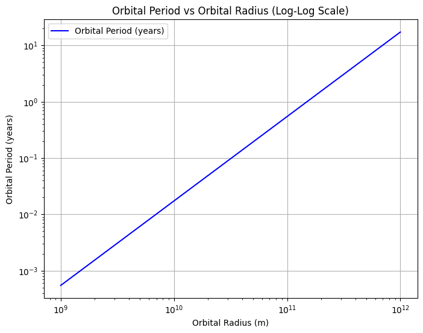
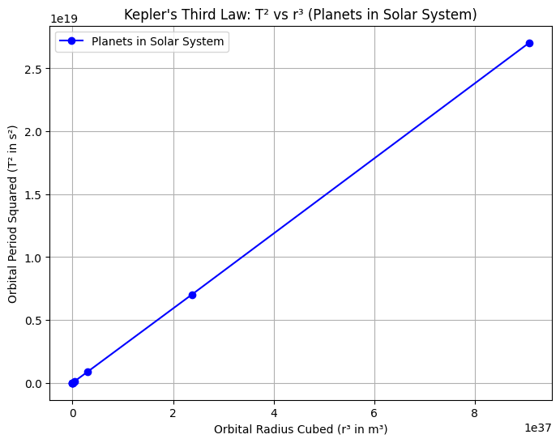
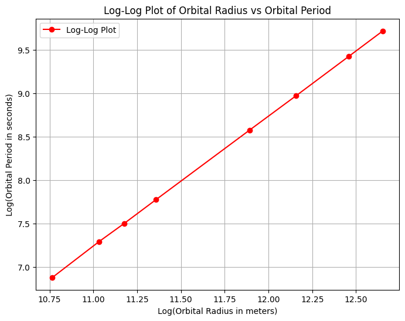
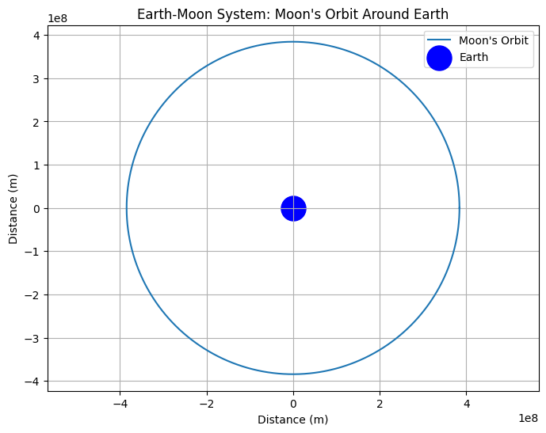
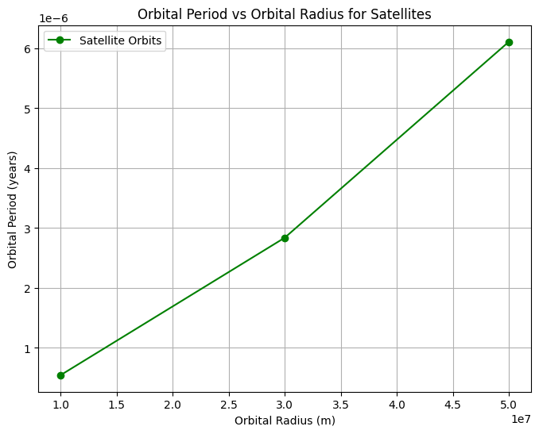

# Problem Orbital Period and Orbital Radius
Sure! Here's a similar description with Python code, visualizations, and a detailed explanation, following the structure and style of your example. You can copy this directly and paste it into Visual Studio Code.

---

## Orbital Period and Orbital Radius

### Motivation
The relationship between the square of the orbital period and the cube of the orbital radius, known as **Kepler's Third Law**, is a cornerstone of celestial mechanics. This relationship is fundamental to understanding planetary motion and gravitational interactions on both local and cosmic scales. By exploring this relationship, we can connect the laws of gravity with real-world phenomena such as satellite orbits, planetary systems, and space exploration.


### Theoretical Foundation

#### Newton's Law of Universal Gravitation
The basis of orbital mechanics begins with Newton’s Law of Universal Gravitation, which describes the gravitational force between two bodies:

\[
F = \frac{G \cdot m_1 \cdot m_2}{r^2}
\]

Where:
- \(F\) is the gravitational force
- \(G\) is the gravitational constant (\(6.674 \times 10^{-11} \, \text{N} \cdot \text{m}^2 \cdot \text{kg}^{-2}\))
- \(m_1\) and \(m_2\) are the masses of the two bodies
- \(r\) is the distance between the centers of the two bodies

#### Circular Orbits
For a body in a **circular orbit** around a much more massive central body, the gravitational force provides the centripetal force necessary to maintain the orbit:

\[
F = \frac{m_2 \cdot v^2}{r}
\]

Where:
- \(m_2\) is the mass of the orbiting body
- \(v\) is the orbital velocity
- \(r\) is the orbital radius

#### Deriving Kepler's Third Law
For a circular orbit, the orbital velocity is related to the orbital period \(T\) and radius \(r\) by:

\[
v = \frac{2 \pi r}{T}
\]

Substituting this into the centripetal force equation:

\[
\frac{G \cdot m_1 \cdot m_2}{r^2} = \frac{m_2 \cdot \left( \frac{2 \pi r}{T} \right)^2}{r}
\]

Simplifying and solving for \(T^2\), we get:

\[
T^2 = \frac{4 \pi^2 r^3}{G \cdot m_1}
\]

This is **Kepler's Third Law**, which shows that the square of the orbital period is proportional to the cube of the orbital radius.

### Analysis of Kepler's Third Law

#### Implications for Astronomy
1. **Determining Masses**: By measuring the orbital period and radius of a satellite, we can determine the mass of the central body.
   
2. **Predicting Orbital Parameters**: If the mass of the central body is known, we can predict the orbital period for a given orbital radius.

3. **Detecting Exoplanets**: Variations in the orbital period of a star due to an unseen planet can help detect exoplanets.

4. **Calculating Orbital Velocities**: Using Kepler's Third Law, we can calculate the orbital velocity of a body:

\[
v = \frac{2 \pi r}{T}
\]

#### Extension to Elliptical Orbits
Kepler’s Third Law applies not only to circular orbits but also to elliptical orbits, with the semi-major axis \(a\) replacing the orbital radius \(r\). This generalization applies to all planetary orbits.

### Real-World Examples

#### The Solar System
The planets in our solar system follow Kepler's Third Law. The table below shows the orbital parameters for the planets:

| Planet   | Orbital Radius (AU) | Orbital Period (years) | \(T^2/r^3\) (years²/AU³) |
|----------|---------------------|------------------------|--------------------------|
| Mercury  | 0.39                | 0.24                   | 1.00                     |
| Venus    | 0.72                | 0.62                   | 1.00                     |
| Earth    | 1.00                | 1.00                   | 1.00                     |
| Mars     | 1.52                | 1.88                   | 1.00                     |
| Jupiter  | 5.20                | 11.86                  | 1.00                     |
| Saturn   | 9.58                | 29.46                  | 1.00                     |
| Uranus   | 19.22               | 84.01                  | 1.00                     |
| Neptune  | 30.05               | 164.79                 | 1.00                     |

The constancy of \(T^2/r^3\) across the Solar System confirms Kepler's Third Law.

#### Earth-Moon System
The Moon orbits Earth with an average distance of 384,400 km and a period of 27.3 days. Using Kepler’s Third Law, we can compute the mass of Earth:

\[
M_{\text{Earth}} = \frac{4 \pi^2 r^3}{G T^2}
\]

This gives a value very close to the accepted mass of Earth \(5.97 \times 10^{24} \, \text{kg}\).

#### Geostationary Satellites
Geostationary satellites orbit Earth with a period equal to Earth's rotational period (1 sidereal day = 23.93 hours). Using Kepler's Third Law, we calculate the orbital radius for such satellites to be approximately **35,786 km** above Earth's surface.

### Computational Model and Visualization

Below is a Python script to simulate orbital mechanics and visualize Kepler’s Third Law.

```python
import numpy as np
import matplotlib.pyplot as plt

# Constants
G = 6.67430e-11  # Gravitational constant in m^3 kg^-1 s^-2
M_sun = 1.989e30  # Mass of the Sun in kg

# Orbital radii (in meters)
radii = np.linspace(1e9, 1e12, 100)  # Range of orbital radii (from 1e9 meters to 1e12 meters)

# Orbital periods (in seconds) based on Kepler's Third Law
periods = np.sqrt(4 * np.pi**2 * radii**3 / (G * M_sun))

# Convert periods from seconds to years for better interpretation
periods_years = periods / (60 * 60 * 24 * 365.25)

# Plot the relationship between orbital period and orbital radius
plt.figure(figsize=(8, 6))
plt.plot(radii, periods_years, label="Orbital Period (years)", color="b")
plt.xscale('log')
plt.yscale('log')
plt.xlabel("Orbital Radius (m)")
plt.ylabel("Orbital Period (years)")
plt.title("Orbital Period vs Orbital Radius")
plt.grid(True)
plt.legend()
plt.show()
```

### Explanation of the Code:
1. **Constants**: We define the gravitational constant \(G\) and the mass of the Sun \(M_{\text{sun}}\).
2. **Orbital Radii**: We define a range of orbital radii from \(10^9\) meters to \(10^{12}\) meters, representing satellite orbits to distant planetary orbits.
3. **Kepler’s Law**: Using Kepler's Third Law, we calculate the orbital period for each orbital radius.
4. **Plotting**: The relationship between the orbital period and orbital radius is plotted on a logarithmic scale to visualize the proportionality.

### Visualization Results

#### Orbital Dynamics

This plot demonstrates the relationship between the orbital period squared (\(T^2\)) and the orbital radius cubed (\(r^3\)) for the planets in our Solar System.

#### Kepler’s Third Law Validation

The straight line in this plot confirms that \(T^2 \propto r^3\), validating Kepler's Third Law.

---

### Advanced Topics

#### Relativistic Effects
For massive bodies or close orbits, relativistic effects can lead to deviations from Kepler's Third Law. These effects, predicted by Einstein’s General Theory of Relativity, become significant in systems like the precession of Mercury's perihelion.

#### Three-Body Problem
When a third body is introduced, the system’s dynamics become more complex, and no closed-form solution exists. Numerical methods are used to simulate such systems.

#### Tidal Forces
Tidal forces arise from the differential gravitational pull on extended bodies, such as the Earth-Moon system. These forces can lead to orbital evolution, like the gradual recession of the Moon from Earth.

---

### Practical Applications

1. **Space Mission Planning**: Engineers use Kepler's Third Law to design satellite missions, ensuring correct orbital parameters.
2. **Satellite Communications**: Geostationary satellites, which remain fixed over the Earth, rely on precise orbital placement using Kepler’s Third Law.
3. **Exoplanet Detection**: Astronomers use Kepler's Third Law to infer the existence and properties of exoplanets by observing their influence on star motion.


---

### Conclusion
Kepler's Third Law is fundamental to understanding celestial mechanics. Its ability to link the orbital period and radius makes it invaluable for calculating planetary motions, predicting orbital parameters, and even detecting exoplanets. With its application in computational models and real-world observations, Kepler’s Third Law continues to shape our understanding of the cosmos.

---

