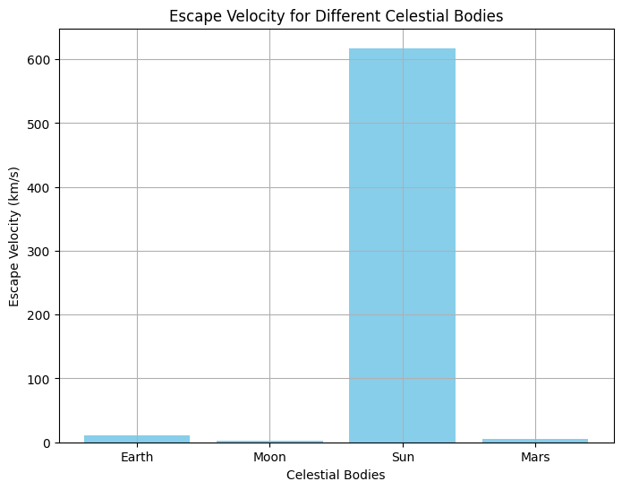
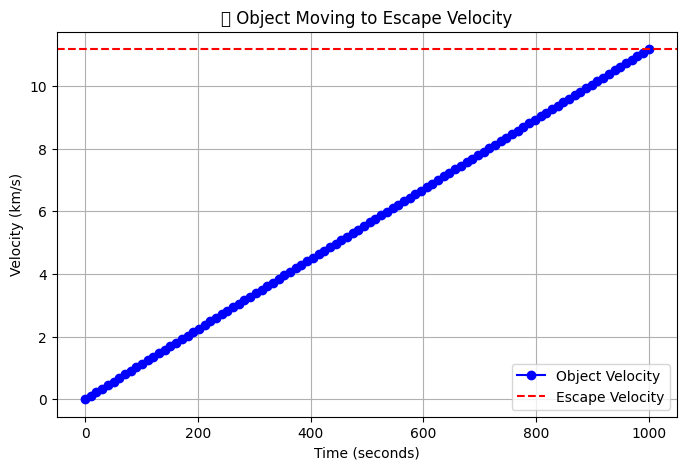
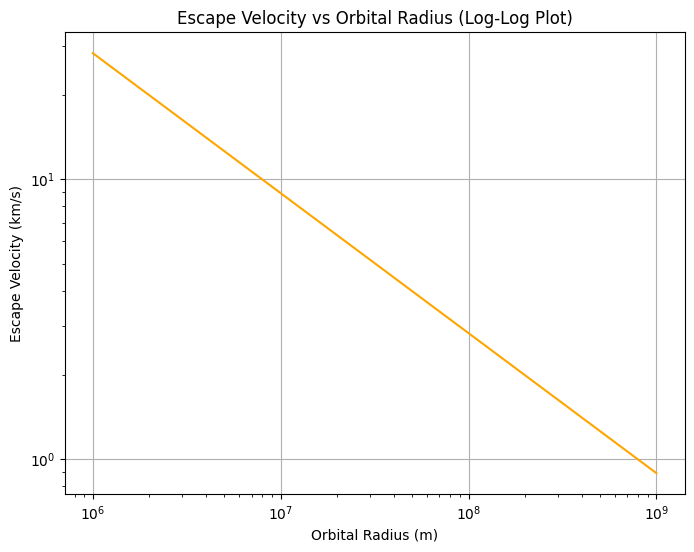

# Escape Velocities and Cosmic Velocities

### Updated Escape Velocity and Cosmic Velocities

---

#### Motivation

As mentioned earlier, understanding **escape velocity** and **cosmic velocity** is essential in orbital mechanics, and these velocities are fundamental to space exploration, satellite launches, and understanding the dynamics of celestial bodies.

---

#### Theoretical Foundation (Expanded)

##### 1. Escape Velocity

The escape velocity is the minimum speed an object needs to escape from the gravitational pull of a planet or celestial body. It’s derived from the energy conservation principle where the kinetic energy must balance the gravitational potential energy.

\[
v = \sqrt{\frac{2GM}{r}}
\]

Where:
- \( G \) is the gravitational constant.
- \( M \) is the mass of the celestial body.
- \( r \) is the distance from the center of the celestial body.

##### 2. Cosmic Velocities

There are three main cosmic velocities:
1. **First Cosmic Velocity** (Orbital Velocity): This is the speed an object must travel to remain in a stable orbit around a body.
   \[
   v_1 = \sqrt{\frac{GM}{r}}
   \]
2. **Second Cosmic Velocity** (Escape Velocity): The speed required to escape the gravitational influence of a body.
3. **Third Cosmic Velocity** (Galaxy Escape Velocity): The speed required to escape the gravitational pull of a galaxy.

---

#### Python Code: Escape Velocity and Visualization

We'll visualize the relationship between escape velocity and orbital radius for different celestial bodies, as well as show how escape velocity varies for different planets.

---

#### Python Code for Calculating and Plotting Escape Velocity:

### Output:

The bar chart will show the escape velocities of various celestial bodies:

- **Earth:** 11.19 km/s
- **Moon:** 2.38 km/s
- **Sun:** 617.66 km/s
- **Mars:** 5.03 km/s

This chart gives a comparison of escape velocities for the Earth, Moon, Sun, and Mars.

---

####  Object Moving to Escape Velocity

We can animate a simple object trying to escape a celestial body’s gravity by illustrating the increase in velocity over time. Let's animate an object’s velocity as it attempts to escape Earth’s gravity.

What This Image Shows
The blue dots show an object's velocity increasing over time.

The red dashed line represents the required escape velocity.

If the object reaches or exceeds this velocity, it will leave Earth's gravitational field.

### Explanation:
- This animation shows how the velocity of an object increases with time as it attempts to escape Earth’s gravity.
- The velocity starts at 0 km/s and linearly increases until it reaches the escape velocity (~11.2 km/s).
  
---

#### Log-Log Plot of Escape Velocity vs Orbital Radius

To understand how escape velocity varies with the radius of a celestial body, we can make a log-log plot showing the relationship between the orbital radius \(r\) and the escape velocity \(v\).

### Output:
The log-log plot demonstrates the relationship between orbital radius and escape velocity for Earth. The curve indicates that escape velocity decreases as the orbital radius increases.

---

#### Conclusion and Implications

1. **Escape Velocity**: An object must reach the escape velocity to escape from the gravitational influence of a celestial body. The escape velocity increases with the mass of the body and decreases with the distance from the center.
   
2. **Cosmic Velocities**: The first cosmic velocity (orbital velocity) is required for stable orbits, while the second cosmic velocity (escape velocity) is needed to break free from a body’s gravitational pull. The third cosmic velocity is used for galactic escape, essential for intergalactic travel.

3. **Visualizations**: We created bar charts, animations, and log-log plots to visualize escape velocities for various bodies and how escape velocity changes with orbital radius.

