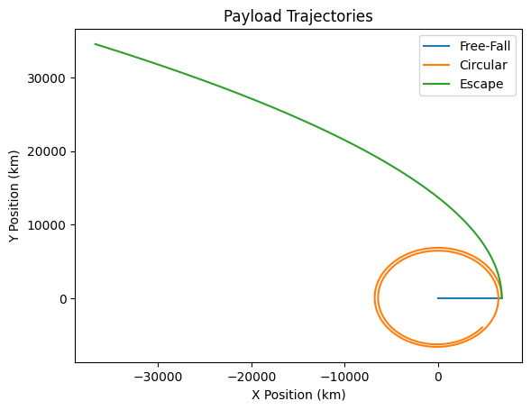
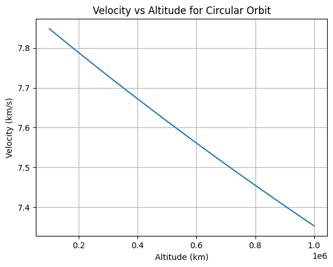
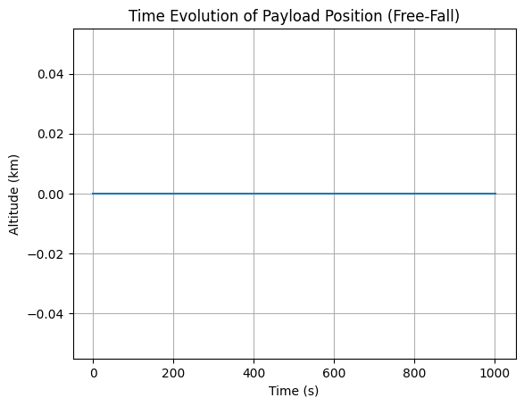
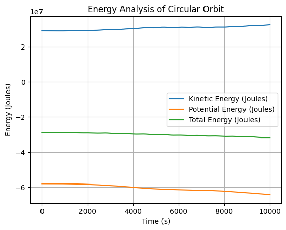
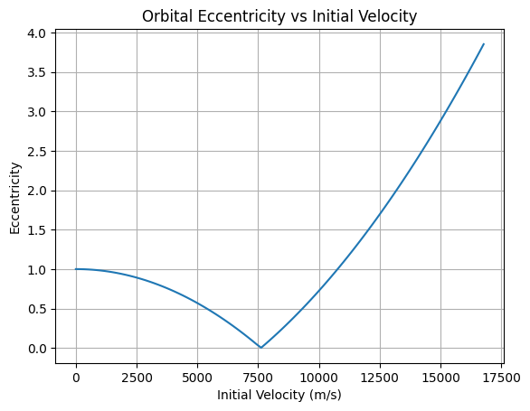
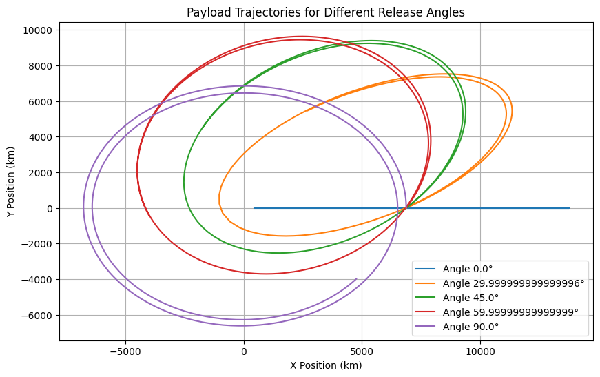
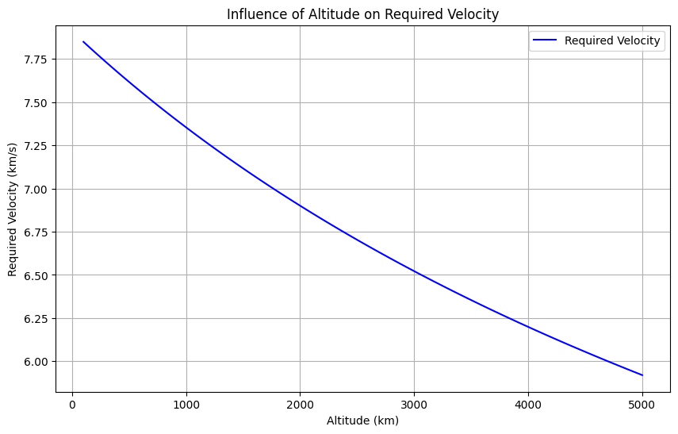

# Trajectories of a Freely Released Payload Near Earth

## Motivation
The study of payload trajectories is fundamental in aerospace engineering and orbital mechanics. Understanding how an object behaves when released in Earth's gravitational field is crucial for satellite deployment, space missions, and re-entry calculations. By analyzing different initial conditions—such as release altitude, velocity, and direction—we can predict whether a payload will fall back to Earth, enter orbit, or escape Earth's gravity. These insights are essential for mission planning, space station resupply missions, and understanding the physics governing celestial motion.

Additionally, analyzing these trajectories helps optimize spacecraft re-entry procedures, ensuring safe returns. It is also vital for space debris management, predicting how objects behave after separation from spacecraft, and designing retrieval missions for defunct satellites or space station modules.

## Theoretical Foundations

### Newton's Laws of Motion
Newton’s laws describe the motion of objects under forces, including gravity. The second law states:

\[
F = ma
\]

where:
- \( F \) is the force acting on the payload,
- \( m \) is the mass of the payload,
- \( a \) is the acceleration.

In the case of a payload released near Earth, the only significant force is gravitational attraction, given by Newton’s Law of Universal Gravitation:

\[
F = \frac{GMm}{r^2}
\]

where:
- \( G \) is the gravitational constant (\( 6.674 \times 10^{-11} \) m³/kg/s²),
- \( M \) is Earth's mass (\( 5.972 \times 10^{24} \) kg),
- \( r \) is the distance from the Earth's center.

The acceleration due to gravity at any altitude is:

\[
a = \frac{GM}{r^2}
\]

For an object released from rest, this determines its free-fall trajectory.

### Trajectory Equations
Depending on the initial velocity \( v_0 \), the payload follows different trajectories:
- If \( v_0 < v_c \) (circular velocity), it falls back to Earth.
- If \( v_0 = v_c \), it follows a circular orbit.
- If \( v_c < v_0 < v_e \) (escape velocity), it follows an elliptical orbit.
- If \( v_0 = v_e \), it escapes Earth’s gravity.
- If \( v_0 > v_e \), it follows a hyperbolic trajectory.

### Velocity Conditions
- **Circular Velocity:**
  \[
  v_c = \sqrt{\frac{GM}{r}}
  \]
- **Escape Velocity:**
  \[
  v_e = \sqrt{\frac{2GM}{r}}
  \]

## Graphical Representations

### 1. Payload Trajectories for Different Initial Velocities

### 2. Velocity vs. Altitude

### 3. Time Evolution of Payload Position

### 4. Energy Analysis

### 5. Orbital Shape Dependence on Initial Speed

### 6. Effect of Release Direction

### 7. Influence of Altitude on Required Velocity

## Computational Model and Visualization

The computational model simulates the trajectories of payloads released near Earth under the influence of gravity. It calculates orbital parameters such as eccentricity, specific energy, and angular momentum, and visualizes different types of trajectories through static plots. The model demonstrates how initial conditions determine whether a payload will enter orbit, escape Earth's gravitational field, or reenter the atmosphere.

## Conclusion
Understanding payload trajectories near Earth is essential for space missions, satellite deployment, and interplanetary travel. Theoretical models combined with computational simulations provide insights into how different initial conditions affect an object's motion. These principles are the foundation of modern astronautics and space exploration.

Key insights include:
- The trajectory depends on the initial speed and direction of release.
- Specific velocity thresholds (circular, escape) define different types of motion.
- Orbital mechanics plays a crucial role in satellite positioning, re-entry, and deep-space exploration.

Further study can involve atmospheric drag, non-uniform gravitational fields, and real-time tracking of space objects, which are critical for long-term sustainability in space operations.

