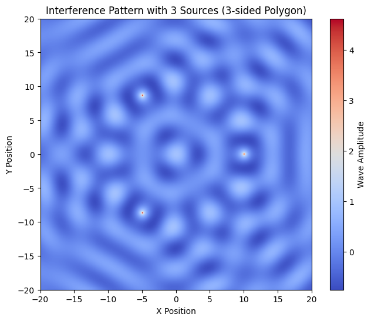
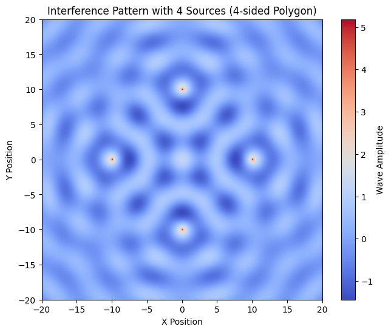
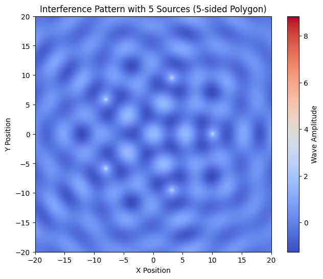
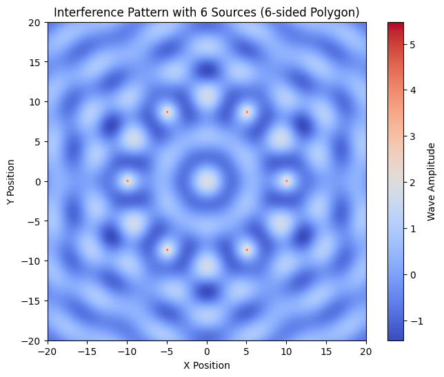

# Problem 1 Waves and Interference Patterns
---
### **Introduction**
When two or more waves meet, their amplitudes add together, leading to constructive or destructive interference. On a water surface, these interference patterns can be observed when ripples from multiple sources interact.

In this problem, we explore the interference patterns generated by placing multiple point sources at the vertices of a regular polygon and simulating the wave behavior.

---

### **Wave Equation for a Single Source**
A single point source at \((x_0, y_0)\) produces circular waves described by:

\[
\eta(x, y, t) = \frac{A}{\sqrt{r}} \cos(kr - \omega t + \phi)
\]

where:
- \( A \) is the wave amplitude,
- \( k = \frac{2\pi}{\lambda} \) is the wave number,
- \( \omega = 2\pi f \) is the angular frequency,
- \( r = \sqrt{(x - x_0)^2 + (y - y_0)^2} \) is the radial distance from the source,
- \( \phi \) is the initial phase.

We extend this equation to multiple sources.

---

### **Superposition of Waves**
When multiple sources are present at the vertices of a regular polygon, the displacement at any point is given by:

\[
\eta_{\text{sum}}(x, y, t) = \sum_{i=1}^{N} \eta_i(x, y, t)
\]

where \( N \) is the number of sources.

Each wave propagates from a different vertex, and their superposition leads to interference patterns.

---

### **Choosing a Regular Polygon**
We analyze wave interference for:
- **Equilateral Triangle (3 sources)**
- **Square (4 sources)**
- **Pentagon (5 sources)**

Each vertex acts as a wave source emitting identical coherent waves.

---

### **Python Implementation**
The following Python code simulates the wave interference pattern for a chosen polygon. It generates plots for visualizing the patterns.

### **Interpretation of Results**
1. **Regions of Constructive Interference**: These appear as bright areas where waves reinforce each other.
2. **Regions of Destructive Interference**: These appear as dark zones where waves cancel out.
3. **Regularity of Patterns**: The symmetry of the pattern depends on the number of sources and their arrangement.

---

### **Experimentation**
Try changing:
- `polygon_sides = 3` for a **triangle**,
- `polygon_sides = 4` for a **square**,
- `polygon_sides = 5` for a **pentagon**.

You can also vary `lambda_`, `A`, and `f` to explore different wave behaviors.

---

### **Conclusion**
This simulation provides a **visual and mathematical understanding** of wave interference. By analyzing different polygonal arrangements, we see how wave superposition creates intricate patterns, reinforcing key principles of wave physics. 

