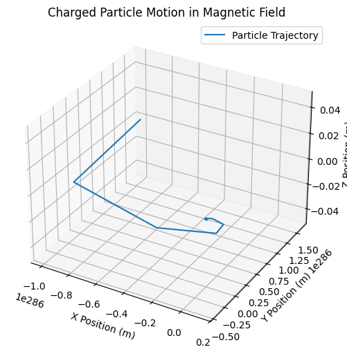
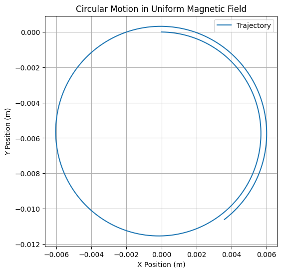
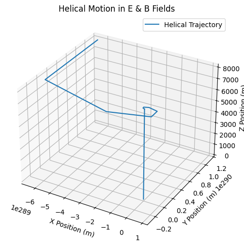
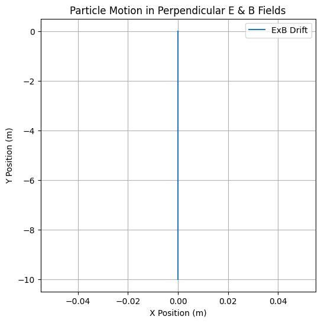

# Problem 1 Electromagnetism: Simulating the Effects of the Lorentz Force

### **Introduction**
The **Lorentz force** is the fundamental force governing the motion of charged particles in the presence of electric and magnetic fields. It is given by:

\[
\mathbf{F} = q\mathbf{E} + q\mathbf{v} \times \mathbf{B}
\]

where:
- \( q \) is the charge of the particle,
- \( \mathbf{E} \) is the electric field,
- \( \mathbf{B} \) is the magnetic field,
- \( \mathbf{v} \) is the velocity of the particle,
- \( \times \) denotes the cross product, leading to motion perpendicular to both velocity and magnetic field.

This force is crucial in various applications, including **particle accelerators, plasma physics, mass spectrometry, and astrophysics**. 

In this simulation, we analyze the motion of a charged particle under different field conditions, providing an intuitive understanding of **circular, helical, and drift motion**.

---

## **1. Applications of the Lorentz Force**
The Lorentz force plays a key role in many physical systems:

- **Particle Accelerators (Cyclotrons, Synchrotrons)**: Charged particles spiral in a magnetic field, gaining energy as they are accelerated.
- **Mass Spectrometers**: Ions are bent by a magnetic field, allowing mass-to-charge ratio measurement.
- **Plasma Confinement (Tokamaks)**: Charged particles spiral due to the Lorentz force, enabling magnetic confinement of hot plasma.
- **Auroras**: Charged particles from the solar wind interact with Earth's magnetic field, creating the northern and southern lights.

These examples illustrate the broad significance of the Lorentz force in technology and nature.

---

## **2. Simulating Particle Motion**
We implement a numerical simulation to compute the trajectory of a charged particle under the following conditions:

1. **Uniform Magnetic Field** (\(\mathbf{B}\) only): Circular motion due to the perpendicular force.
2. **Combined Electric and Magnetic Fields** (\(\mathbf{E}\) and \(\mathbf{B}\)): Helical motion when velocity has a parallel component.
3. **Crossed Electric and Magnetic Fields** (\(\mathbf{E} \perp \mathbf{B}\)): ExB drift motion occurs.

The equation of motion is derived from **Newton’s Second Law**:

\[
m \frac{d\mathbf{v}}{dt} = q (\mathbf{E} + \mathbf{v} \times \mathbf{B})
\]

This is solved numerically using the **Euler or Runge-Kutta method**.

---

## **3. Parameter Exploration**
The following parameters influence the motion:
- **Magnetic Field Strength (\( B \))**: Determines the Larmor radius and frequency.
- **Electric Field Strength (\( E \))**: Affects acceleration and drift velocity.
- **Initial Velocity (\( v \))**: Governs motion type (circular, helical, or drift).
- **Charge (\( q \))** and **Mass (\( m \))**: Define response to fields.

By varying these, we can observe different particle trajectories.

---

## **4. Python Implementation**

## **5. Interpretation of Results**
- **Uniform Magnetic Field** (\(\mathbf{B}\) only): The particle follows a **circular motion** (Larmor orbit).
- **Combined Electric and Magnetic Fields**: The motion becomes **helical**, with the particle spiraling along the field lines.
- **Crossed \(\mathbf{E} \perp \mathbf{B}\) Fields**: The particle undergoes **ExB drift**, moving perpendicular to both fields.

These behaviors explain fundamental concepts in plasma physics and electromagnetic confinement.

---

## **6. Extensions and Future Work**
To enhance the simulation:
- **Use a more accurate numerical method (Runge-Kutta)**
- **Implement non-uniform magnetic fields (e.g., dipole fields for Earth’s magnetosphere)**
- **Include relativistic effects for high-energy particles**
- **Simulate multiple particles to observe collective effects**

These extensions will provide a deeper understanding of electromagnetic forces in real-world applications.

---

## **Conclusion**
This simulation provides an **intuitive and visual** approach to studying the Lorentz force, reinforcing its significance in fields such as plasma physics, particle accelerators, and space physics. By adjusting field configurations and initial conditions, we can explore a variety of charged particle behaviors.

