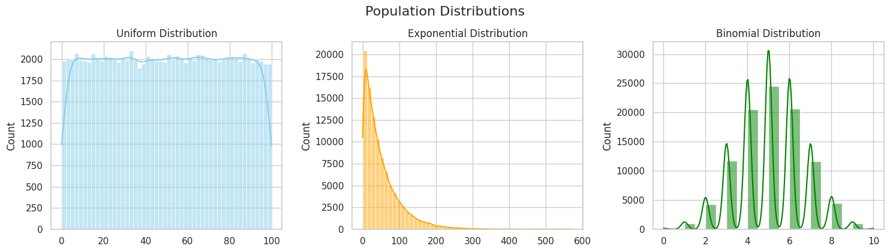
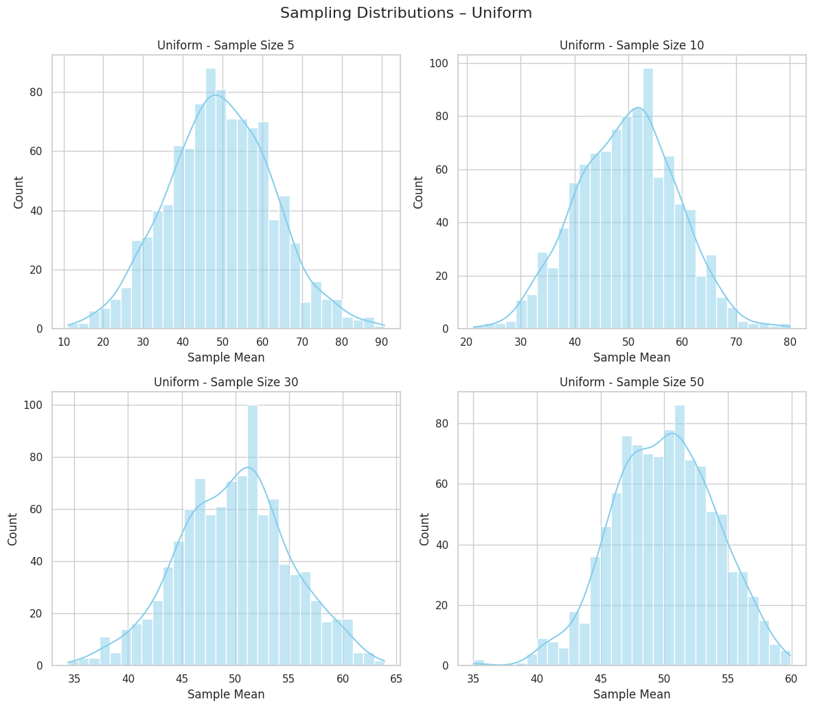

# Problem 2 
# 🧮 **Estimating π Using Monte Carlo Methods**

---

## 🎯 **Motivation**

Monte Carlo simulations are a class of numerical techniques that rely on **random sampling** to approximate mathematical and physical results. One of the most famous and intuitive applications of Monte Carlo methods is estimating the value of \(\pi\) — a fundamental constant in mathematics — using **geometric probability**.

This task links key concepts from:
- **Probability and randomness**
- **Geometry**
- **Numerical approximation methods**

By simulating large numbers of random experiments and observing how outcomes statistically align with geometric properties, students gain insights into:
- The power of Monte Carlo methods
- The connection between randomness and precision
- Practical computation of abstract mathematical constants like \(\pi\)

These methods are widely used in areas such as **finance**, **physics**, **engineering**, and **AI modeling**.

---

## 🔵 **Part 1: Estimating π Using a Circle**

---

### 📘 **1. Theoretical Foundation**

Imagine a unit square \([0,1] \times [0,1]\) that contains a **quarter circle** of radius 1 in the corner.

We randomly generate points \((x, y)\) within the square. Some of them fall **inside** the quarter circle, defined by the inequality:

\[
x^2 + y^2 \leq 1
\]

The area of the full unit circle is \(\pi r^2 = \pi\), and the square's area is 4 (if the circle is inscribed in a square with sides of length 2).

By comparing the ratio of points inside the circle to the total number of random points, we can estimate \(\pi\):

\[
\pi \approx 4 \cdot \frac{\text{Points inside circle}}{\text{Total points}}
\]

As the number of points increases, the estimate becomes more accurate due to the **Law of Large Numbers** and **Central Limit Theorem**.

---

### 🧪 **2. Simulation**

We simulate the process using Python:

- Generate \(n\) random points in the square.
- Check whether each point lies inside the circle.
- Compute the ratio of points inside vs. total points.
- Multiply the ratio by 4 to estimate \(\pi\).

---

### 📊 **3. Visualization**

We can visualize the simulation by plotting the generated points:

- 🔵 Blue: points inside the circle
- 🔴 Red: points outside the circle

Example Output for 10,000 points:  
🖼️ *(Insert output image after running the code in Google Colab)*

---

### 📈 **4. Analysis**

We study how increasing the number of points affects the **accuracy** of the estimate:

- Try with increasing values: 100, 1,000, 10,000, 100,000
- Plot the convergence of estimates compared to the real value of \(\pi\)

📌 **Observation:**
- The estimate becomes more stable and accurate as \(n\) increases.
- The graph converges toward the true value of \(\pi \approx 3.14159\).
- Randomness causes fluctuation, especially with small samples.

---
# Part 2 
Sure, here’s a complete and structured explanation for **Buffon’s Needle simulation**, following the same format as the previous Monte Carlo π estimation task:

---

# 🎯 Estimating π Using Buffon’s Needle Method

---

## 🧠 Theoretical Foundation

Buffon’s Needle is one of the oldest known problems in geometric probability. It provides a probabilistic method to estimate π through a physical or simulated experiment.

### 📌 Setup:

- We have **parallel lines** on a plane, spaced a fixed distance apart (e.g., 2 units).
- A **needle of a certain length** (e.g., 1 unit) is dropped randomly onto the plane.
- We measure whether the needle **crosses any of the lines**.

### 📐 Derivation of Formula:

Let:
- \( L \): length of the needle  
- \( d \): distance between the lines  
- \( N \): number of needles dropped  
- \( C \): number of needles that cross a line  

If \( L \leq d \), then the **probability** that a needle crosses a line is:

\[
P = \frac{2L}{\pi d}
\]

Solving for π:

\[
\pi \approx \frac{2L \cdot N}{d \cdot C}
\]

This formula becomes more accurate as **N** increases.

---

## 🧪 Simulation

We simulate the dropping of many needles by randomly generating:
- The **center position** of the needle (between lines)
- The **angle** at which it falls

The condition for crossing a line is:

\[
x \leq \frac{L}{2} \cdot \sin(\theta)
\]

If true, the needle crosses one of the parallel lines.

### 🛠 Key Steps:
1. Generate random center \( x \) between 0 and \( d/2 \)
2. Generate random angle \( \theta \in [0, \frac{\pi}{2}] \)
3. Count how many needles satisfy the crossing condition
4. Use the π estimation formula

---

## 📊 Visualization

To visualize the simulation:
- Each needle is drawn as a line segment at its given angle and center.
- **Green needles** cross a line.
- **Red needles** do not cross.
- Dashed horizontal lines represent the **parallel lines**.

This helps to intuitively observe which needles contribute to estimating π.

---

## 📈 Analysis

To explore accuracy and convergence:

- We **vary the number of needle drops** (e.g., 100, 1000, 5000, 10,000).
- At each step, we compute the **estimated π**.
- Then we compare it to the actual value of π to analyze the **absolute error**:

\[
$\text{Error} = \left| \pi_{\text{true}} - \pi_{\text{estimated}} \right|
\]$

### 🔍 Key Observations:

- **More drops → more accurate estimate**, but with slower convergence.
- Compared to the circle method, **Buffon’s Needle converges more slowly** and shows more variance in small samples.
- The method is **mathematically elegant**, but less practical for fast/precise π estimation.

---

Let me know if you'd like the **code for the convergence analysis** of Buffon's Needle too (with graphs like in the previous task)!