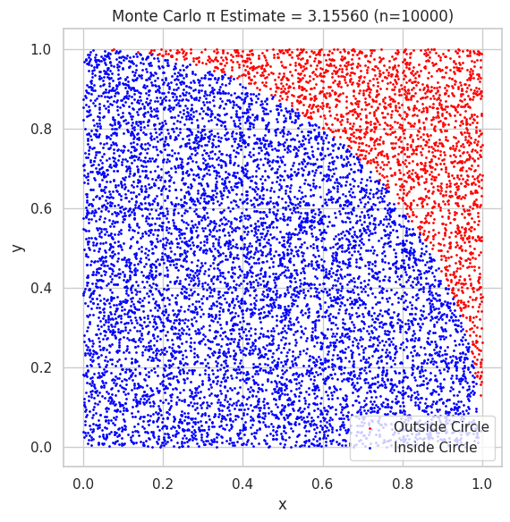
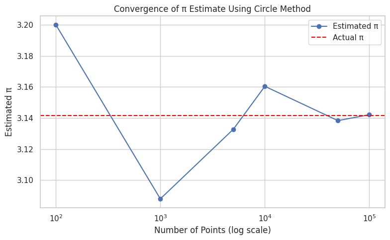
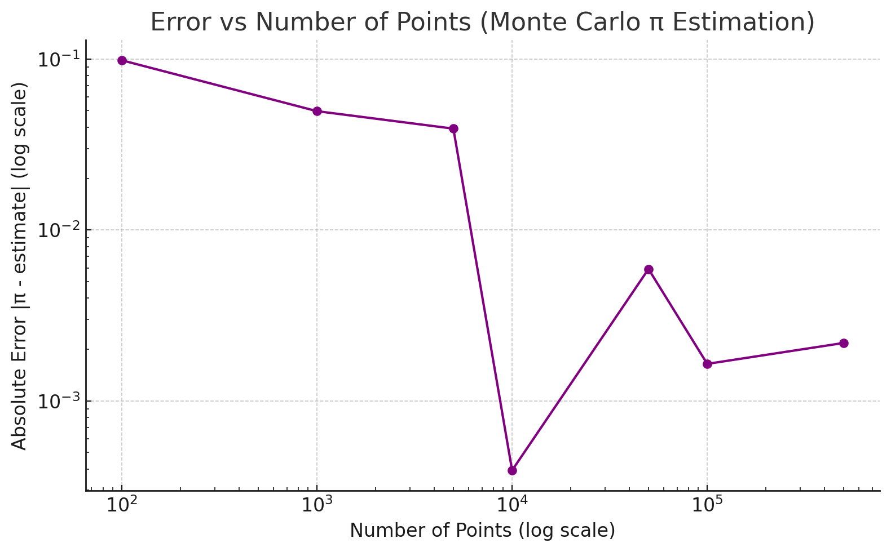

# Problem 2 
# 🧮 **Estimating π Using Monte Carlo Methods**

---

## 🎯 **Motivation**

Monte Carlo simulations are a class of numerical techniques that rely on **random sampling** to approximate mathematical and physical results. One of the most famous and intuitive applications of Monte Carlo methods is estimating the value of \(\pi\) — a fundamental constant in mathematics — using **geometric probability**.

This task links key concepts from:
- **Probability and randomness**
- **Geometry**
- **Numerical approximation methods**

By simulating large numbers of random experiments and observing how outcomes statistically align with geometric properties, students gain insights into:
- The power of Monte Carlo methods
- The connection between randomness and precision
- Practical computation of abstract mathematical constants like \(\pi\)

These methods are widely used in areas such as **finance**, **physics**, **engineering**, and **AI modeling**.

---

## 🔵 **Part 1: Estimating π Using a Circle**

---

### 📘 **1. Theoretical Foundation**

Imagine a unit square \([0,1] \times [0,1]\) that contains a **quarter circle** of radius 1 in the corner.

We randomly generate points \((x, y)\) within the square. Some of them fall **inside** the quarter circle, defined by the inequality:

\[
x^2 + y^2 \leq 1
\]

The area of the full unit circle is \(\pi r^2 = \pi\), and the square's area is 4 (if the circle is inscribed in a square with sides of length 2).

By comparing the ratio of points inside the circle to the total number of random points, we can estimate \(\pi\):

\[
\pi \approx 4 \cdot \frac{\text{Points inside circle}}{\text{Total points}}
\]

As the number of points increases, the estimate becomes more accurate due to the **Law of Large Numbers** and **Central Limit Theorem**.

---

### 🧪 **2. Simulation**

We simulate the process using Python:

- Generate \(n\) random points in the square.
- Check whether each point lies inside the circle.
- Compute the ratio of points inside vs. total points.
- Multiply the ratio by 4 to estimate \(\pi\).

---

### 📊 **3. Visualization**

We can visualize the simulation by plotting the generated points:

- 🔵 Blue: points inside the circle
- 🔴 Red: points outside the circle

Example Output for 10,000 points:  
🖼️ *(Insert output image after running the code in Google Colab)*

---

### 📈 **4. Analysis**

We study how increasing the number of points affects the **accuracy** of the estimate:

- Try with increasing values: 100, 1,000, 10,000, 100,000
- Plot the convergence of estimates compared to the real value of \(\pi\)

📌 **Observation:**
- The estimate becomes more stable and accurate as \(n\) increases.
- The graph converges toward the true value of \(\pi \approx 3.14159\).
- Randomness causes fluctuation, especially with small samples.

---
