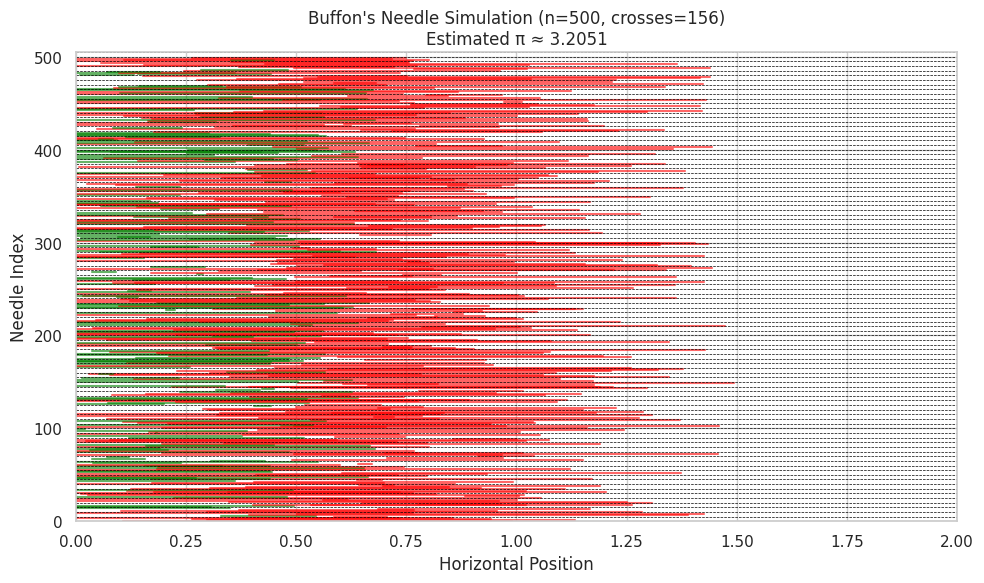
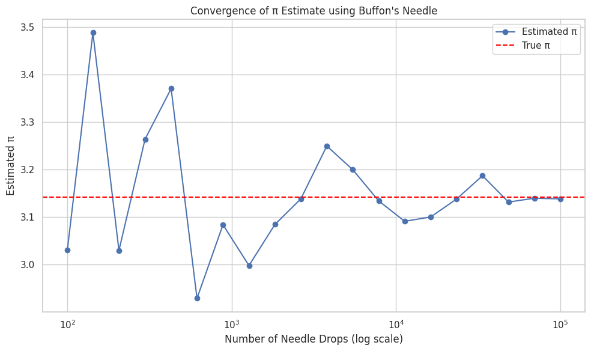

# Problem 1
Sure, here’s a complete and structured explanation for **Buffon’s Needle simulation**, following the same format as the previous Monte Carlo π estimation task:

---

# 🎯 Estimating π Using Buffon’s Needle Method

---

## 🧠 Theoretical Foundation

Buffon’s Needle is one of the oldest known problems in geometric probability. It provides a probabilistic method to estimate π through a physical or simulated experiment.

### 📌 Setup:

- We have **parallel lines** on a plane, spaced a fixed distance apart (e.g., 2 units).
- A **needle of a certain length** (e.g., 1 unit) is dropped randomly onto the plane.
- We measure whether the needle **crosses any of the lines**.

### 📐 Derivation of Formula:

Let:
- \( L \): length of the needle  
- \( d \): distance between the lines  
- \( N \): number of needles dropped  
- \( C \): number of needles that cross a line  

If \( L \leq d \), then the **probability** that a needle crosses a line is:

\[
P = \frac{2L}{\pi d}
\]

Solving for π:

\[
\pi \approx \frac{2L \cdot N}{d \cdot C}
\]

This formula becomes more accurate as **N** increases.

---

## 🧪 Simulation

We simulate the dropping of many needles by randomly generating:
- The **center position** of the needle (between lines)
- The **angle** at which it falls

The condition for crossing a line is:

\[
x \leq \frac{L}{2} \cdot \sin(\theta)
\]

If true, the needle crosses one of the parallel lines.

### 🛠 Key Steps:
1. Generate random center \( x \) between 0 and \( d/2 \)
2. Generate random angle \( \theta \in [0, \frac{\pi}{2}] \)
3. Count how many needles satisfy the crossing condition
4. Use the π estimation formula

---

## 📊 Visualization

To visualize the simulation:
- Each needle is drawn as a line segment at its given angle and center.
- **Green needles** cross a line.
- **Red needles** do not cross.
- Dashed horizontal lines represent the **parallel lines**.

This helps to intuitively observe which needles contribute to estimating π.

---

## 📈 Analysis

To explore accuracy and convergence:

- We **vary the number of needle drops** (e.g., 100, 1000, 5000, 10,000).
- At each step, we compute the **estimated π**.
- Then we compare it to the actual value of π to analyze the **absolute error**:

\[
\text{Error} = \left| \pi_{\text{true}} - \pi_{\text{estimated}} \right|
\]

### 🔍 Key Observations:

- **More drops → more accurate estimate**, but with slower convergence.
- Compared to the circle method, **Buffon’s Needle converges more slowly** and shows more variance in small samples.
- The method is **mathematically elegant**, but less practical for fast/precise π estimation.

---

Let me know if you'd like the **code for the convergence analysis** of Buffon's Needle too (with graphs like in the previous task)!
